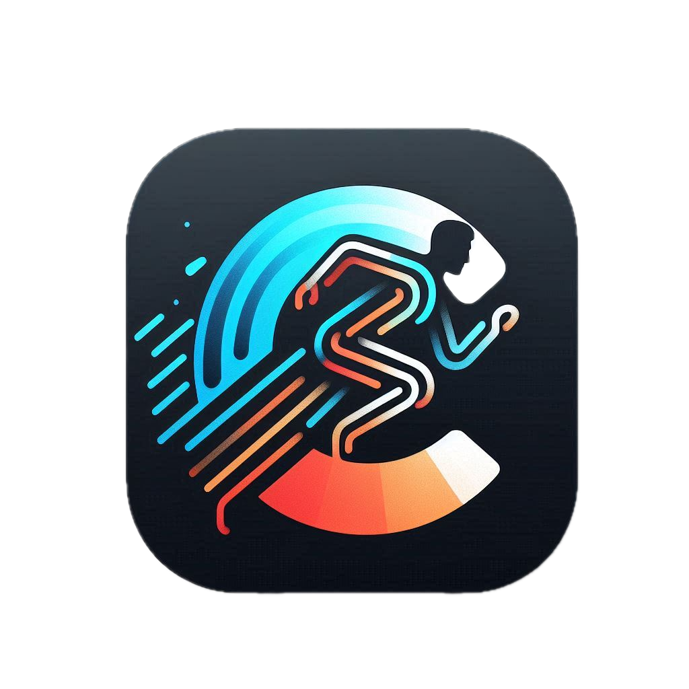

# Carrera Run Strava Dashboard

A small full-stack starter for connecting to the Strava API and displaying running activities in a React UI.

## Stack

- Node.js + Express API in `apps/api`
- React + TypeScript + Vite frontend in `apps/web`
- Strava OAuth 2.0 authorization code flow handled on the backend
- MongoDB for training plan persistence

## Features

- Sign in with Strava
- Backend token exchange and refresh support
- Dashboard summary for recent running activity
- Activities table with date, distance, moving time, elevation, and pace
- Activity detail panel in the UI

## Local Setup

1. Create a Strava application in the Strava developer portal.
2. Configure the authorization callback URL as `http://localhost:4000/api/auth/strava/callback`.
3. Copy `.env.example` to `.env` and fill in your Strava credentials.
4. Install dependencies with `npm install` from the repository root.
5. Start the app with `npm run dev`.

Frontend runs on `http://localhost:5173` and proxies API requests to `http://localhost:4000`.

## Environment Variables

- `STRAVA_CLIENT_ID`: Strava application client ID
- `STRAVA_CLIENT_SECRET`: Strava application client secret
- `STRAVA_REDIRECT_URI`: Backend callback endpoint
- `STRAVA_SCOPES`: Requested Strava scopes
- `SESSION_SECRET`: Session signing secret for local development
- `CLIENT_ORIGIN`: Frontend origin allowed by the API
- `PORT`: API port
- `MONGODB_URI`: MongoDB connection string used by planning endpoints
- `MONGODB_DB_NAME`: MongoDB database name (default `carrera_run`)

## Planning API (MongoDB-backed)

- `GET /api/plans`
- `POST /api/plans`
- `GET /api/plans/:id`
- `PATCH /api/plans/:id`
- `POST /api/plans/:id/activities`
- `PATCH /api/plans/:id/activities/:activityId`
- `DELETE /api/plans/:id/activities/:activityId`

## Notes

- The app stores tokens in the server session for local development.
- Secrets remain on the backend; the browser never sees the Strava client secret.
- The current UI focuses on runs. Other activity types are filtered out of the dashboard metrics.
